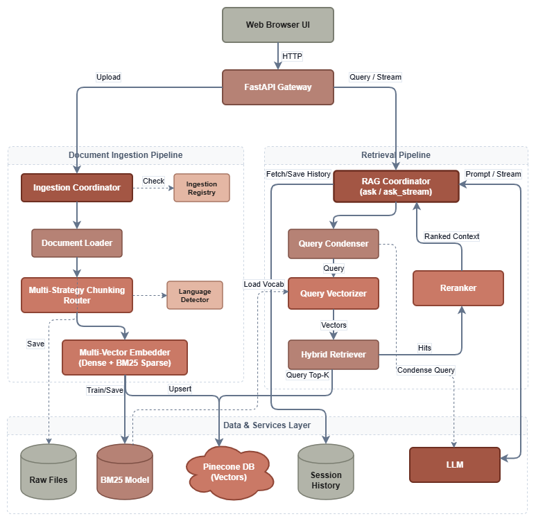

# MultiRAG v2: Multilingual Document Intelligence
A production-ready, enterprise-grade local RAG (Retrieval-Augmented Generation) platform designed for multilingual document question-answering.

MultiRAG combines hybrid search (dense embeddings + BM25 sparse keyword matching), cross-encoder reranking, multi-strategy document chunking, and conversational memory with query contextualization, streaming responses locally via Ollama.

---

## Key Features

* **Hybrid Search (Dense + Sparse)**: Combines semantic vector similarity (HuggingFace `all-MiniLM-L6-v2`, 384 dimensions) with keyword-exact BM25 sparse token matching in Pinecone Serverless using tunable convex alpha blending:

  `Score = α · DenseScore + (1 - α) · SparseScore`

* **Two-Stage Retrieval with Cross-Encoder**: Queries retrieve top candidates (default 15), which are reranked using a pairwise cross-encoder (`BAAI/bge-reranker-base`) down to the top-$k$ most authoritative chunks.
* **Modality-Aware Multi-Strategy Chunking**: Replaces naive character splitting with semantic routing:
  * **Hierarchical Parent-Child**: Long PDFs and textbooks index concise 400-character child chunks while retrieving full parent sections.
  * **Header-Ancestor**: Markdown and Word documents preserve structural outline hierarchy.
  * **Slide-Node**: PPTX files are grouped per slide with titles and embedded tables.
  * **Schema-Aware**: JSON datasets are parsed by records without broken syntax.
  * **Recursive Sentence-Boundary**: Text and short PDFs preserve grammatical sentences using NLTK boundary detection.
* **Conversational Memory & Query Condensation**: Multi-turn chat sessions maintain rolling turn windows. Pronouns and follow-ups are contextualized into standalone search queries before retrieval.
* **Multilingual Support**: Automatic language detection across 55+ languages ensures answers and citations respond in the user's language.
* **Real-Time Token Streaming**: True Server-Sent Events (SSE) streaming direct from Ollama into a modern glassmorphic web interface.

---

## Architecture

<p align="center">
  
</p>

---

## Technology Stack

| Layer | Component | Description |
| --- | --- | --- |
| **Backend & API** | **FastAPI** | Async REST API with Server-Sent Events (SSE) streaming |
| **Vector Database** | **Pinecone Serverless** | Hybrid index storing dense vectors (384-d) + sparse BM25 indices |
| **Local LLM** | **Ollama** | Local LLM inference (`qwen3:8b`) |
| **Dense Embeddings** | **Sentence-Transformers** | `sentence-transformers/all-MiniLM-L6-v2` (384-d) |
| **Sparse Embeddings** | **Pinecone Text (BM25)** | Corpus-fitted statistical keyword frequency encoder |
| **Reranker** | **BAAI Cross-Encoder** | `BAAI/bge-reranker-base` for cross-attention scoring |

---

## Quick Start Guide

### 1. Setup Environment

Requires Python 3.10+, [uv](https://github.com/astral-sh/uv), and [Ollama](https://ollama.com).

```bash
git clone https://github.com/Mukasshaf/MultiRAG.git
cd MultiRAG
uv sync

```

### 2. Configure Credentials

Copy the template and configure your Pinecone credentials and Ollama endpoint:

```bash
# Windows PowerShell
Copy-Item .env.example .env

# Linux / macOS
cp .env.example .env

```

### 3. Run Application

Start the local model engine and web server:

```bash
ollama serve
ollama pull qwen3:8b
uv run python main.py

```

Access the UI at `http://localhost:8000`. Interactive API documentation is available at `http://localhost:8000/docs`.

---

## Batch Ingestion & Evaluation

For document batch ingestion, BM25 vocabulary fitting, and golden-set RAG evaluation benchmarks, refer to the [Scripts Documentation](scripts/README.md).

---

## REST API Reference

Interactive Swagger documentation is available at `http://localhost:8000/docs`.

| Method | Endpoint | Description |
| --- | --- | --- |
| `GET` | `/` | Web application interface |
| `GET` | `/health` | Live health probe checking Ollama and Pinecone connections |
| `POST` | `/chat` | SSE endpoint streaming real-time generated tokens (`session_id`, `query`) |
| `POST` | `/chat/full` | Non-streaming endpoint returning full JSON payload |
| `POST` | `/upload` | Multipart file upload; triggers ingestion and Pinecone indexing |
| `GET` | `/documents` | Lists all indexed documents, chunk counts, and timestamps |
| `DELETE` | `/documents/{filename}` | Deletes document vectors from Pinecone and removes local file |
| `GET` | `/index/stats` | Returns Pinecone index statistics |
| `GET` | `/sessions/{session_id}` | Retrieves multi-turn conversation history |

---

## License

MIT License. Free for personal, academic, and commercial use.
